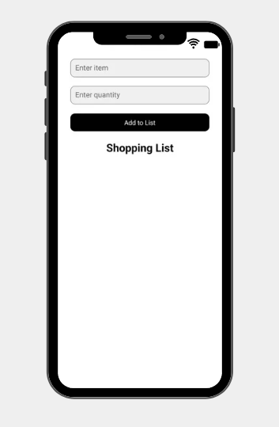
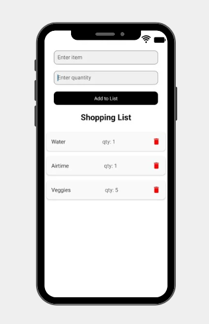

# Shopping List App

This is a **Shopping List Application** built using **React Native**, **CSS**, and a **REST API**. The app allows users to efficiently create and manage shopping lists, specify item quantities, and perform CRUD operations. All data is stored locally for a seamless experience.

## Features

### User Features:
1. **Shopping List Management:**
   - Add new shopping lists.
   - Edit existing shopping lists.
   - Delete shopping lists.
   - View all saved shopping lists.
   
2. **Item Management:**
   - Add items to a shopping list with specific quantities.
   - Edit item details such as name and quantity.
   - Delete items from a list.

3. **Local Storage Integration:**
   - All shopping lists and their items are stored locally.
   - Data is persisted across app restarts.
   
4. **User-Friendly Interface:**
   - Intuitive UI with smooth navigation.
   - Responsive design for optimal mobile usability.

## Technology Stack
- **Frontend:** React Native
- **Styling:** CSS
- **Storage:** Local Storage (AsyncStorage)

## Installation

To run this project locally, follow these steps:

1. Clone the repository:
   ```bash
   git clone https://github.com/Portia-Nelly-Mashaba/Shopping-List--react-native-and-redux.git
   ```
2. Navigate to the project directory:
   ```bash
   cd shopping-list-app
   ```
3. Install dependencies:
   ```bash
   npm install
   ```
4. Start the application:
   ```bash
   npx react-native run-android  # For Android
   npx react-native run-ios      # For iOS
   ```

## API Endpoints
| Method | Endpoint       | Description                 |
|--------|--------------|-----------------------------|
| GET    | /lists       | Fetch all shopping lists    |
| POST   | /lists       | Create a new shopping list  |
| PUT    | /lists/:id   | Update a shopping list      |
| DELETE | /lists/:id   | Delete a shopping list      |
| GET    | /items       | Fetch all items             |
| POST   | /items       | Add an item to a list       |
| PUT    | /items/:id   | Update an item              |
| DELETE | /items/:id   | Delete an item              |

## Screenshots





